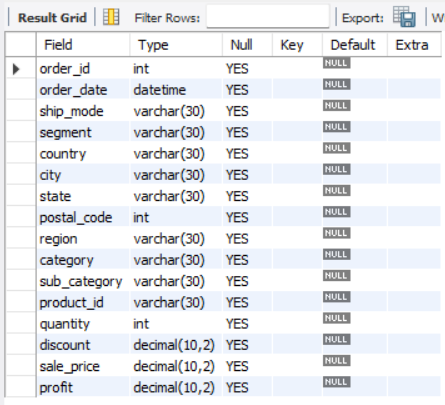
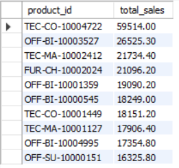
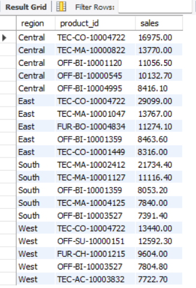
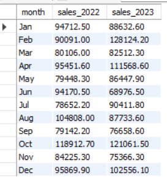
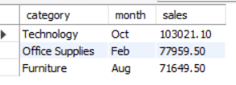
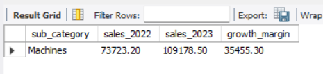
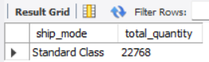

# Retail Orders ETL Project

This project demonstrates an end-to-end ETL (Extract, Transform, Load) pipeline to analyze retail order data. The dataset, sourced from Kaggle, was processed and analyzed to gain insights into sales, product performance, and shipping preferences.

## Project Overview
1. **Data Extraction**: Downloaded the retail order dataset using the Kaggle API.
2. **Data Transformation**: Cleaned and renamed columns, optimized data types to save memory, created additional columns for analysis, and connected the dataset to a MySQL server.
3. **Data Analysis**: Conducted SQL-based analysis for insights into top-performing products, sales trends by region, and customer shipping preferences. Each query result is documented in the `Images` folder.

## Prerequisites
- MySQL Server
- Python (for Kaggle API data download and preprocessing)
- Kaggle API Key

## Database and Table Setup
1. **Database Creation**: Created the ETL database and `tb_orders` table, optimized for efficient memory usage.
2. **Images of Query Results**: Results for each query are shown in the order below, starting with `image_1.png` in the `Images` folder.

## Analysis Screenshots

1. **Table Description with Data Types**  
   

2. **Top 10 Highest Sales-Generating Products**  
   

3. **Top 5 Highest-Selling Products in Each Region**  
   

4. **Month-Over-Month Sales Comparison for 2022 and 2023**  
   

5. **Top Month by Sales for Each Category**  
   

6. **Sub-Category with Highest Profit Growth from 2022 to 2023**  
   

7. **Most Preferred Shipping Mode**  
   

## Conclusion
This ETL project demonstrates a complete workflow for data processing, from extraction and transformation to analysis, generating valuable business insights on sales trends, product performance, and customer shipping preferences.
